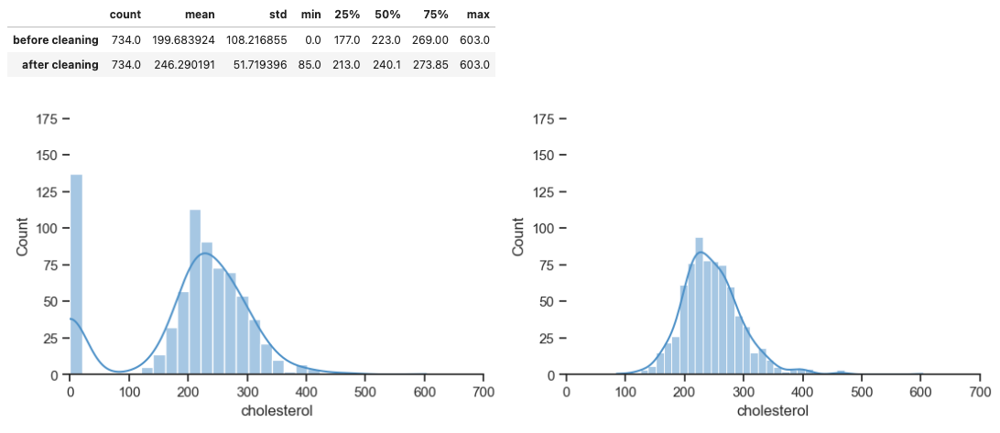
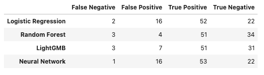

## Heart Failure Prediction Dataset

**Стек:** Python, Pandas, Numpy, Sklearn, Tensorflow, Seaborn

#### Краткое описание проекта

https://www.kaggle.com/fedesoriano/heart-failure-prediction

В датасете представлена информация о пациентах пяти клиник, специализирующихся на сердечно-сосудистых заболеваниях. Необходимо выбрать модель, которая наиболе точно определяет наличие заболевания, используя для этого предоставленные одиннадцать признаков, среди которых пол и возраст пациента, кровяное давление, уровень холестерина, сахара и т.д. 

#### Исследуемые модели

- Linear: Logistic Regression.
- CART: Random Forest.
- Boosting: LightGBM.

Метрика эффективности: максимизация Recall при сохранении Precision на уровне не ниже 75%.

#### Некоторые особенности

- Категориальные переменные кодируются через Weight of Evidence.  
- Пропущенные данные и выбросы заполняются методом ближайших соседей (KNN).

 

#### Результаты

В контексте максимизации Recall наиболее эффективной моделью является нейронная сеть (P: 77%, R: 98%, F1: 86%).  
Наилучший баланс Precision/Recall обеспечивает Random Forest (P: 93%, R: 94%, F1: 94%).

