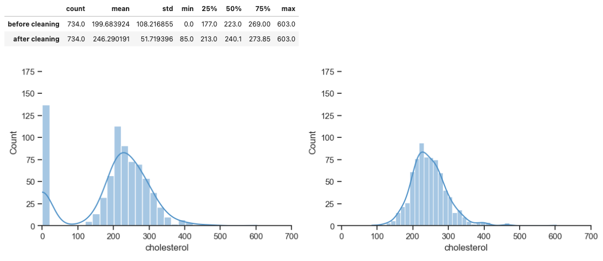
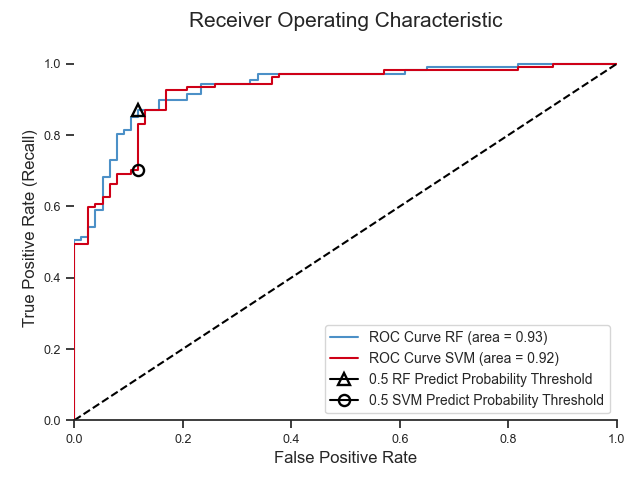
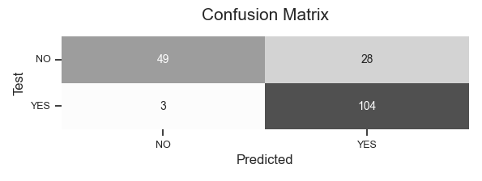
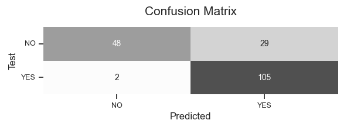
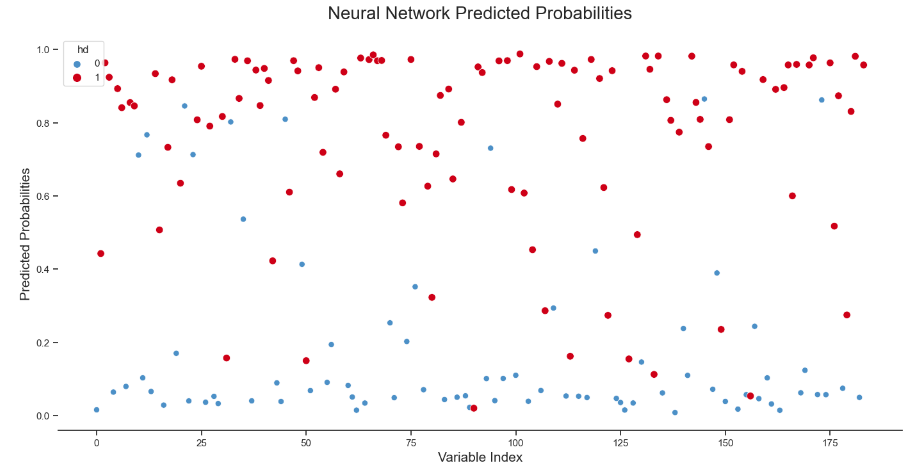
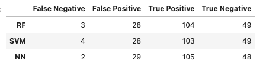

## Heart Failure Prediction Dataset

**Стек:** Python, Pandas, Numpy, Sklearn, Tensorflow, Seaborn

#### Краткое описание проекта

https://www.kaggle.com/fedesoriano/heart-failure-prediction

В датасете представлена информация о пациентах пяти клиник, специализирующихся на сердечно-сосудистых заболеваниях. Необходимо выбрать модель, которая наиболе точно определяет наличие заболевания, используя для этого предоставленные одиннадцать признаков, среди которых пол и возраст пациента, кровяное давление, уровень холестерина, сахара и т.д. 

Пропущенные данные заполняются методом ближайших соседей.

Применяется два варианта кодирования категориальных переменных: Target Encoding и One-Hot Encoding.  
Тестируются следующие алгортимы: kNN, Random Forest, Support Vector Machine, SGDC, Extra Trees, Linear Regression.  
В качестве финальных моделей выбраны RF и SVM. После подбора гиперпараметров строятся ROC-кривые.  

Дополнительно проводится сравнение лучшей модели Random Forest с нейронной сетью.

**Random Forest**

**Neural Network**

**Визуализация классификации, выполненной нейронной сетью**

**Результаты трех моделей: RF, SVM, NN**

